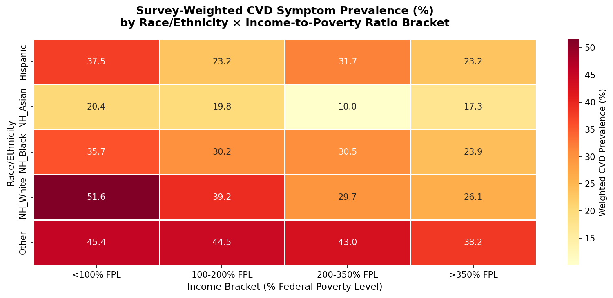
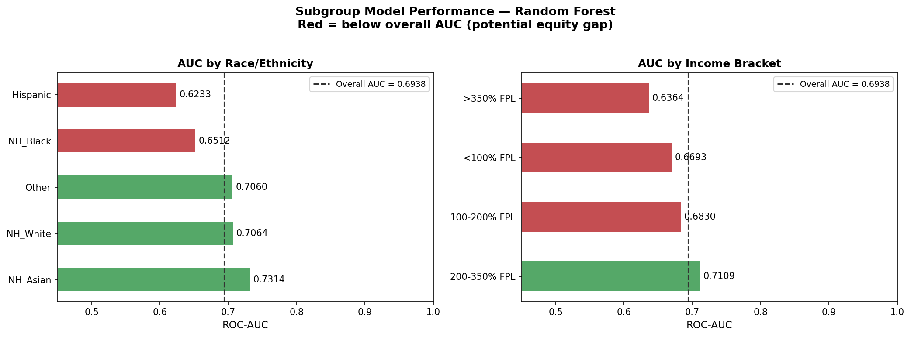
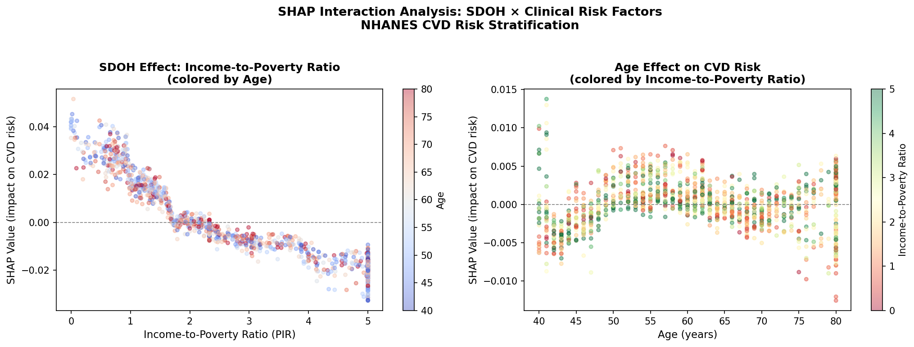
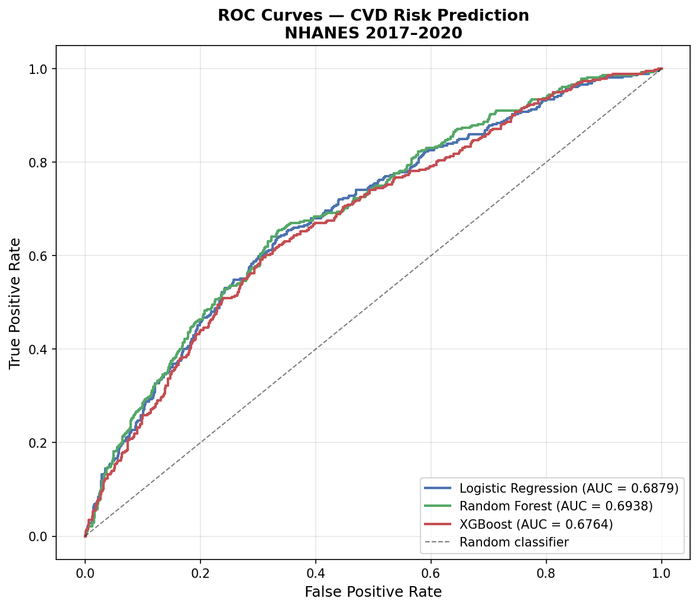

# CVD Risk Stratification — NHANES 2017–2020
### Health Equity Analysis with Survey-Weighted Statistics, ML Modeling, and SHAP Explainability

[](https://nhanes-cvd-risk.streamlit.app)

---

## Overview

This project applies machine learning to CDC NHANES 2017–March 2020 Pre-Pandemic data to predict cardiovascular disease (CVD) symptoms in U.S. adults aged 40+, with a focus on **health equity** — examining how social determinants of health (SDOH), specifically income-to-poverty ratio, independently drive CVD risk across demographic groups.

Unlike typical student ML projects, this analysis:
- Applies **survey weights** (`WTMECPRP`) to produce nationally representative estimates
- Performs **stratified subgroup AUC analysis** by race/ethnicity and income — diagnosing where model performance degrades for specific populations
- Uses **SHAP interaction analysis** to quantify how income modifies CVD risk across age groups
- Presents findings through an **interactive Streamlit dashboard**

---

## Dataset

**Source:** [CDC NHANES 2017–March 2020 Pre-Pandemic Public Use Files](https://wwwn.cdc.gov/nchs/nhanes/continuousnhanes/default.aspx?Cycle=2017-2020)

| File | Component | Key Variables |
|------|-----------|---------------|
| P_DEMO.XPT | Demographics | Age, sex, race/ethnicity, income-to-poverty ratio, survey weights |
| P_CDQ.XPT | Cardiovascular Health | Chest pain on exertion (target), shortness of breath |
| P_BMX.XPT | Body Measures | BMI, waist circumference |
| P_BPXO.XPT | Blood Pressure | Systolic BP, diastolic BP |
| P_TCHOL.XPT | Total Cholesterol | Total cholesterol (mg/dL) |
| P_DIQ.XPT | Diabetes | Diabetes diagnosis |

**Final dataset:** N = 6,429 adults aged 40+ after merging and cleaning

---

## Methods

### Feature Engineering
- 4 clinical flag features: hypertension (SBP >= 130), obesity (BMI >= 30), high cholesterol (>= 200 mg/dL), pulse pressure
- 4 interaction terms: age × sex, age × diabetes, SBP × cholesterol, BMI × diabetes
- Race/ethnicity dummy encoding (5 categories)

### Models
| Model | CV AUC | Test AUC |
|-------|--------|----------|
| Logistic Regression | — | 0.6879 |
| Random Forest | — | 0.6938 |
| XGBoost (tuned) | — | 0.6764 |

### Survey-Weighted Analysis
NHANES uses complex multistage probability sampling. All prevalence statistics use `WTMECPRP` sample weights — unweighted analysis would misrepresent the U.S. population by overrepresenting certain demographic groups by design.

---

## Key Findings

**Health Equity**
- Survey-weighted CVD symptom prevalence varies significantly across race/ethnicity and income groups
- Income-to-poverty ratio (`income_pir`) is a top SHAP predictor — SDOH independently predicts CVD risk beyond clinical variables
- Subgroup AUC analysis reveals performance gaps for specific demographic groups, highlighting where the model is less reliable

**SHAP Interaction Analysis**
- Low-income individuals show higher SHAP contributions from `income_pir` toward CVD risk regardless of age
- The income × age interaction demonstrates that poverty amplifies age-related CVD risk in older adults

---

## Visualizations

| | |
|---|---|
|  |  |
| Survey-weighted CVD prevalence by race × income | Model performance equity diagnostic |
|  |  |
| SDOH × clinical risk interaction (SHAP) | ROC curves — all models |

---

## Interactive Dashboard

The Streamlit dashboard provides four interactive views:
- **Health Equity** — survey-weighted prevalence charts and race × income heatmap
- **Model Performance** — ROC curves and subgroup AUC equity diagnostics
- **SHAP Analysis** — feature importance and income/age interaction plots
- **Risk Calculator** — input patient characteristics, get predicted CVD probability

The dashboard downloads NHANES data directly from CDC on first load — no local files needed.

**To run locally:**
```bash
pip install -r requirements.txt
streamlit run nhanes_dashboard.py
```

---

## Repository Structure

```
NHANES-CVD-Risk-Stratification/
├── nhanes_cvd_risk_stratification.ipynb   # Full analysis notebook
├── nhanes_dashboard.py                    # Streamlit dashboard
├── requirements.txt                       # Python dependencies
├── equity_heatmap.png                     # Race × income prevalence heatmap
├── subgroup_auc.png                       # Subgroup AUC equity analysis
├── shap_beeswarm.png                      # SHAP beeswarm plot
├── shap_bar.png                           # SHAP feature importance bar
├── shap_interactions.png                  # SHAP interaction analysis
├── roc_curves.png                         # ROC curves all models
└── README.md
```

---

## Tech Stack

Python, pandas, NumPy, scikit-learn, XGBoost, SHAP, Matplotlib, Seaborn, Streamlit

---

## Author

**Arjun Barde**
M.S. Health Informatics (Data Science), University of Pittsburgh
[linkedin.com/in/arjun-barde-2224473b5](https://linkedin.com/in/arjun-barde-2224473b5)
