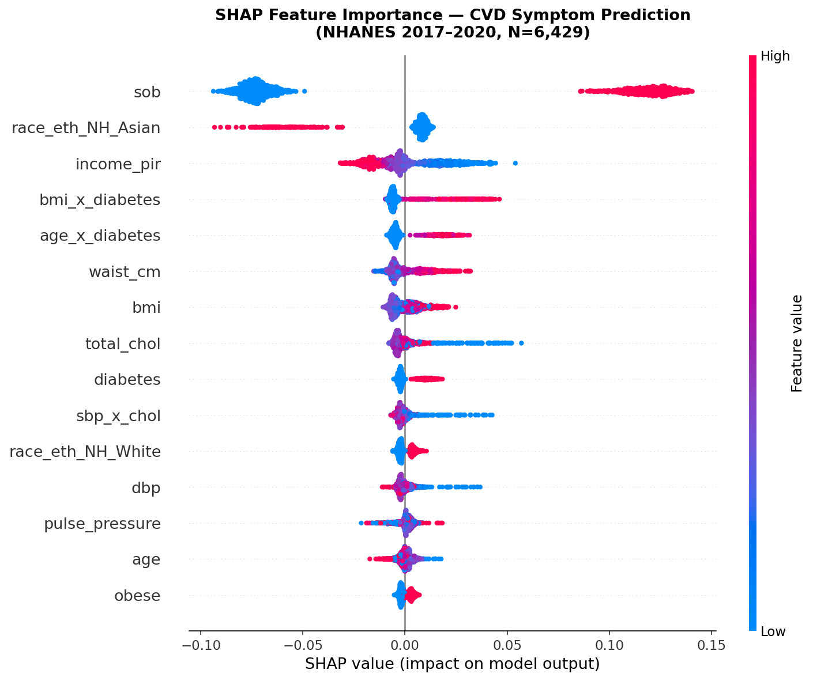
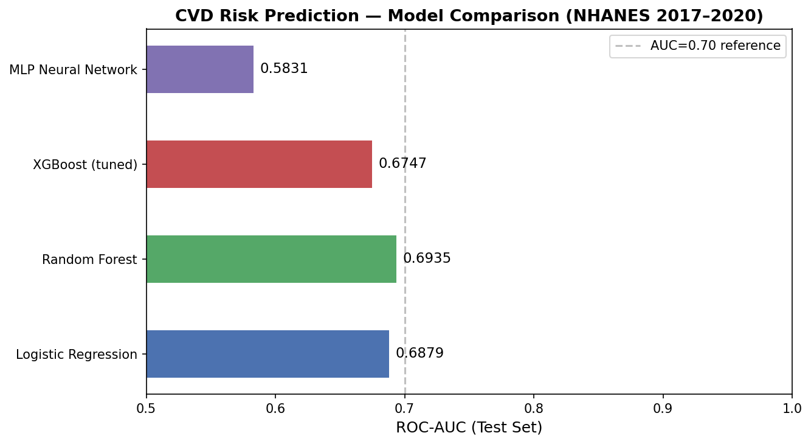

# NHANES CVD Risk Stratification

Cardiovascular disease symptom risk stratification using NHANES 2017–2020 federal survey data. Merges 6 XPT files across 4 NHANES components, engineers clinical features, benchmarks 4 ML classifiers, and applies SHAP explainability to identify key predictors of CVD symptoms in U.S. adults aged 40+.

---

## Project Overview

| | |
|---|---|
| **Dataset** | CDC NHANES 2017–March 2020 Pre-Pandemic Public Use Files |
| **Population** | 6,429 adults aged 40+ (nationally representative U.S. sample) |
| **Target** | CVD symptom — chest pain on exertion (CDQ001, positive rate: 29.5%) |
| **Features** | 22 features including 4 engineered interaction terms |
| **Best Model** | Random Forest (Test AUC = 0.6935) |

---

## SHAP Feature Importance



**Top predictors by mean |SHAP|:**

| Feature | Mean \|SHAP\| | Clinical Interpretation |
|---|---|---|
| `sob` | 0.0916 | Shortness of breath — dominant predictor; correlated cardiopulmonary symptom |
| `race_eth_NH_Asian` | 0.0145 | Race/ethnicity differential in CVD symptom reporting |
| `income_pir` | 0.0131 | Lower income independently associated with higher symptom risk |
| `bmi_x_diabetes` | 0.0089 | Compounded metabolic risk: obesity + diabetes interaction |
| `age_x_diabetes` | 0.0074 | Age amplifies diabetes-associated CVD symptom risk |

---

## Model Comparison



| Model | CV AUC | Test AUC |
|---|---|---|
| Logistic Regression | 0.6968 | 0.6879 |
| **Random Forest** | **0.7001** | **0.6935** |
| XGBoost (tuned) | 0.6865 | 0.6747 |
| MLP Neural Network | 0.5977 | 0.5831 |

All models evaluated with 5-fold stratified cross-validation + 80/20 held-out test split.

---

## Methods

**Data & Preprocessing**
- Merged 6 NHANES XPT files on participant ID (SEQN): demographics, body measures, blood pressure, cholesterol, diabetes questionnaire, and CVD symptom questionnaire
- Restricted to adults 40+ (CDQ administration criteria), yielding N=6,429
- Median imputation for continuous variables with missingness (BP ~17%, cholesterol ~14%, BMI ~10%)
- One-hot encoded race/ethnicity across 5 categories

**Feature Engineering**
- `pulse_pressure` — SBP minus DBP, a clinical arterial stiffness marker
- `age_x_diabetes` — interaction term: age × diabetes diagnosis
- `bmi_x_diabetes` — interaction term: BMI × diabetes diagnosis  
- `sbp_x_chol` — interaction term: systolic BP × total cholesterol
- Binary clinical flags: `hypertension` (SBP ≥ 130), `obese` (BMI ≥ 30), `high_chol` (≥ 200 mg/dL)

**Explainability**
- SHAP TreeExplainer applied to Random Forest for patient-level prediction attribution
- Shortness of breath emerged as the dominant predictor (mean |SHAP| = 0.0916), with income and metabolic interaction terms as secondary drivers

---

## Key Findings

- Shortness of breath was by far the strongest predictor of CVD symptom risk — consistent with clinical literature on correlated cardiopulmonary presentations
- Income-to-poverty ratio was a significant social determinant — lower income independently drove higher symptom probability
- Engineered interaction terms (BMI × diabetes, age × diabetes) contributed meaningful predictive signal beyond raw features
- Random Forest outperformed tuned XGBoost, likely reflecting the moderate sample size and mixed feature types in NHANES survey data

---

## Data Sources

All data publicly available from CDC NHANES — no registration required:  
https://wwwn.cdc.gov/nchs/nhanes/continuousnhanes/default.aspx?Cycle=2017-2020

| File | Component | Contents |
|---|---|---|
| P_DEMO.XPT | Demographics | Age, sex, race/ethnicity, income, survey weights |
| P_BMX.XPT | Examination | BMI, waist circumference |
| P_BPXO.XPT | Examination | Systolic and diastolic blood pressure |
| P_TCHOL.XPT | Laboratory | Total cholesterol |
| P_DIQ.XPT | Questionnaire | Diabetes diagnosis |
| P_CDQ.XPT | Questionnaire | CVD symptom questionnaire (target variable) |

> XPT files are not included in this repo. Download from CDC and place in a `data/` folder before running the notebook.

---

## Setup

```bash
pip install pandas numpy scikit-learn xgboost shap matplotlib seaborn jupyter
```

Download the 6 XPT files from CDC (links above) into a `data/` folder, then open and run `nhanes_cvd_risk_stratification.ipynb`.

---

## Author

**Arjun Barde**  
M.S. Health Informatics & Data Science, University of Pittsburgh  
linkedin.com/in/arjun-barde-2224473b5
